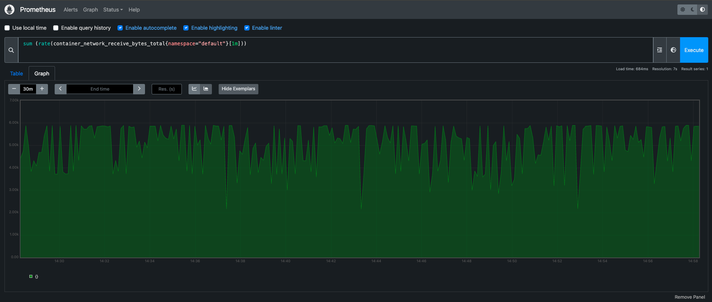

# Kubernetes voting stack on kind (with optional AI agent)

End-to-end demo: a **multi-service voting app** (vote → Redis → worker → Postgres → result) on **Kubernetes**, with guides for **kind** on **AWS EC2**, **Argo CD**, and observability. An optional **FastAPI + LangGraph** agent (`agent/`) can answer Kubernetes questions using Gemini and MCP-style tooling.

## What’s in this repo

| Area | Description | Images (Docker Hub) |
|------|-------------|---------------------|
| **Microservices** | `vote/` (Python), `worker/` (.NET), `result/` (Node.js) | `patracoder/examplevotingapp_vote:v1.0`<br>`patracoder/examplevotingapp_result:v1.0`<br>`patracoder/examplevotingapp_worker:v1.0` |
| **Kubernetes** | `k8s/` manifests, kind-oriented setup | |
| **Platform** | kind, kubectl, Dashboard, Argo CD, Vault, Envoy | |
| **AI agent** | `agent/` — FastAPI, MCP (IDE), LangGraph, Guardrails | `patracoder/k8s-ai-agent:v1.0` |


## Vault + Gateway API notes (Kubernetes)

- **Secrets**: DB/Redis credentials are stored in **Vault** and injected into pods (instead of applying real `Secret` YAMLs).
- **Routing**: Gateway API manifests in `k8s/` (GatewayClass/Gateway/HTTPRoute) route `/`, `/vote`, `/result`.
- **Minimal dev safety**: DB/Redis run with `ServiceAccount` `voting-app`, and Vault role `app-role` is bound to that ServiceAccount (not `default`).
- **DevOps onboarding**: see [`k8s/DEVOPS_USAGE_EXAMPLE.md`](k8s/DEVOPS_USAGE_EXAMPLE.md).

## Architecture


## Observability

  


## Quick start (local)

1. **Clone** the repository (do not commit secrets; see [Security before you push](#security-before-you-push-to-github)).
2. **Environment file**  
   - Docker Compose reads Postgres-related variables from **`agent/.env`** only.  
   - Copy the template:  
     `cp agent/.env.example agent/.env` (Linux/macOS) or `copy agent\.env.example agent\.env` (Windows), then edit values.  
   - Root [`.env.example`](.env.example) is a short pointer to the same.
3. **Run with Docker Compose** (from repo root; adjust if your layout differs):

    ```bash
    docker compose up --build
    ```

**Option 2: Run with prebuilt images (Fastest)**  
If you want to run the stack without building from source, use the pre-synchronized images file:

    ```bash
    docker compose -f docker-compose.images.yml up
    ```

4. Open the **vote** and **result** UIs using the ports defined in your `docker-compose.yml` (commonly `5000` / `5001` — check the file for your setup).

For the **Kubernetes AI agent** alone: install Python deps under `agent/`, configure `agent/.env`, then run Uvicorn as described in [agent/README.md](agent/README.md).

## EC2, kind, and Argo CD (high level)

This project was documented around:

- Launching an **AWS EC2** instance  
- Installing **Docker** and **kind**, creating a cluster  
- **kubectl** and optional **Kubernetes Dashboard**  
- **Argo CD** install and GitOps-style app deployment  

Use your own cluster credentials and never commit kubeconfig or cloud keys.

## Troubleshooting (Docker Compose)

### Temporal restarts: `password authentication failed for user "postgres"`

- **`POSTGRES_PWD` and `POSTGRES_PASSWORD` in `agent/.env` must be the same string.** The `db` service uses `POSTGRES_PASSWORD` when the data directory is first created; `temporalio/auto-setup` connects with `POSTGRES_PWD`.
- If you **changed the password in `.env` after Postgres already ran once**, the old password is still stored in the **`db-data` volume**. Either set both variables back to the password used on first run, or reset the volume (deletes DB data):

  ```bash
  docker compose down -v
  docker compose up -d --build
  ```

- On Windows, avoid stray spaces or mismatched quotes in `.env`; use UTF-8 without a BOM if you edit with Notepad.

## Security before you push to GitHub

- **`agent/.env` is gitignored** — it must stay local. Only **`agent/.env.example`** (placeholders) belongs in the repo.  
- Before `git add`, run:

  ```bash
  git status
  git check-ignore -v agent/.env
  ```

  You should see that `agent/.env` is ignored.  
- **Do not commit**: API keys (Google, LangChain/LangSmith), database passwords, kubeconfig files, or InsForge-style project JSON with keys.  
- **If a secret was ever committed** (or pasted in a chat/issue), **rotate it** in the provider console and treat the old value as compromised.  
- Demo manifests (for example base64 in sample Secrets) are for **local/kind learning only** — use sealed secrets or external secret managers in real environments.

## Resume / portfolio blurb (short)

**Title:** Automated deployment of containerized apps on AWS with Kubernetes and Argo CD  

**Summary:** Hands-on project deploying a voting application on Kubernetes (kind), integrating CI/CD patterns with Argo CD, observability, and optional AI-assisted cluster tooling.  

**Stack:** AWS EC2, Docker, kind, Kubernetes, Argo CD, Redis, Postgres, optional Grafana/Prometheus.

## Credits

Inspired by classic **Docker example-voting-app**-style architectures and extended with k8s/kind/Argo CD workflows.  

**Aapke DevOps Wale Bhaiya** — [TrainWithShubham](https://www.trainwithshubham.com/)
